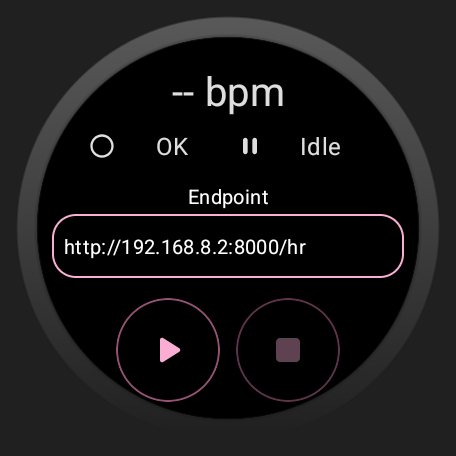
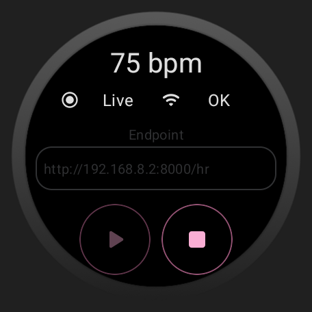

# HeartRateStreamer

An Wear OS app that streams your real-time heart rate data to another device (e.g., PC) via the local network.

|||
| --- | --- |

## Quick Start

This repository contains a Wear OS app `HeartRateStreamer` for transmitting real-time heart rate data and a simple receiver `HeartRateReceiver` for testing. You can try this app by following these steps:

1. **Deploy the App**: Open `HeartRateStreamer` with **Android Studio**, compile the Wear OS app, and deploy it to your Smart Watch.
2. **Deploy the Receiver**: On the receiving device (e.g. a PC), use Python to run the example receiver `HeartRateReceiver/main.py`. This program will start an HTTP server on port `9025` to receive heart rate data. Here is an example of the terminal output:
   ```
   INFO:root:Starting HTTP server...
   INFO:root:IP addresses: [...]
   INFO:root:Server port: 9025
   ```
3. **Check your Network**: Ensure that your **Smart Watch** and your **receiving device** are on the same network.
4. **Start Transmission**: Launch the app on your Smart Watch, enter the endpoint of the receiving service in the input field (e.g. `http://192.168.8.2:9025/hr`), and click the `Play` button below to start transmitting heart rate data. You need to allow this app to access your health data and heart rate data when launching it for the first time.
5. **View the Data**: Once data transmission starts, the terminal of the receiving service will output the received heart rate data. Here is an example of the terminal output
   ```
   192.168.8.2 - - [24/Nov/2025 00:20:42] "POST /hr HTTP/1.1" 200 -
   INFO:root:{
               "heart_rate": 75.0,
               "timestamp": 1763943639450
           }
   192.168.8.2 - - [24/Nov/2025 00:20:43] "POST /hr HTTP/1.1" 200 -
   INFO:root:{
               "heart_rate": 80.0,
               "timestamp": 1763943640450
           }
   192.168.8.2 - - [24/Nov/2025 00:20:44] "POST /hr HTTP/1.1" 200 -
   INFO:root:{
               "heart_rate": 85.0,
               "timestamp": 1763943641450
           }
   ```
6. **(Optional) Applications**: 
   - **For VRChat users**, you can install the Python module `python-osc`. When running the receiver example, it will send the heart rate data to the VRChat client via OSC protocol, the value of beat per minute will be set to the HR parameter of the avatar (See: [OSC Overview for VRChat](https://docs.vrchat.com/docs/osc-overview)).
   - **For OBS users**, you can add a browser source and set the URL to `http://REPLACE_WITH_RECEIVER_ADDRESS/hr` (e.g. `http://127.0.0.1:9025/hr` if the receiver is on the same machine). Then, modify the custom CSS to:
     ```css
     body {
       background-color: rgba(0, 0, 0, 0);
       margin: 0px auto;
       overflow: hidden;
       color: #fc86c0;
       font-size: 200px;
       font-family: 'Brush Script MT', cursive;
     }
     ```
   - **For Prometheus users**, you can set up a Prometheus server to scrape the heart rate data from the receiver endpoint.
